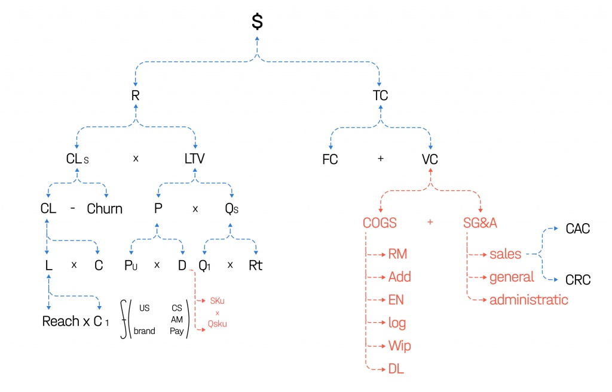

# Формула прибыли

## Доходная часть

### Что сохранилось?
Левая доходная часть почти не изменилась. Она представляет собой ветку успешных клиентов, производную от охвата, первой конверсии, лидов, конверсии, желающих купить, четырех видов оттока. Кроме этого, левая часть зависит от LTV, производной от усилий по апселлу, кроссселлу, усилий в области построения бренда, свойств ассортиментной матрицы, платежеспособности привлекаемого спроса, стоимости каждой товарной позиции, глубины чека, среднего чека. 

## Что изменилось?

Мы разделили глубину чека на число уникальных SKU в чеке и среднее количество уникальных SKU в чеке. Это позволяет определить паттерн поведения выгодного для компании потребителя (покупает много одинаковых SKU или разных) и проводить интересные оптимизации. Человек, тяготеющий к большому количеству одинаковых SKU, потребляет по модели гипермаркета. Для супермаркета такой покупатель — JTBD, «похищенный» у другой стратегической группы.

Например, мы можем увидеть разницу между клиентами, которые покупают 5 банановых йогуртов (SKU = 1, Qsku = 5, т.о. D = 5), и клиентами, которые покупают только 3 банановых и два клубничных( SKU=2, Qsku=2,5, т.о. D = 5).

## Часть издержек
Что сохранилось?
Общие издержки по-прежнему дробятся на постоянные и переменные. Переменные издержки увеличиваются вместе с ростом объемов производства, постоянные — нет. В Формуле осталось два показателя: Customer Acquisition Cost — стоимость получения нового клиента или его поглощение в базу и Customer Retention Cost — стоимость удержания существующего клиента. 

### Что изменилось?

В новой версии часть переменных издержек делится на COGS и SG&A. Под COGS (от англ. Cost of the Goods Sold) мы подразумеваем полноценную себестоимость как таковую. Показатель был в третьей версии Формулы, но рассматривался под другим углом. SG&A (от англ. Sales General & Administrative Costs) – все те переменные издержки, которые мы не можем отнести к себестоимости. И те и другие увеличиваются вместе с объемом производства и продаж, но COGS растет в среднем линейно, а SG&A — не линейно. 

К COGS мы относим издержки, которые можно реально сопоставить с каждой единицей произведенной продукции. Издержки, которые нельзя сопоставить с объемами выпуска иначе как посредством логических ухищрений — это SG&A. COGS распадается на 6 составляющих: 

1. Raw Materials – сырьевая себестоимость. Затраты на материалы, необходимые для производства.

2. Additional Materials – затраты на дополнительные материалы. Такие материалы нужны для производства, с точки зрения технологического процесса, но непосредственно не создают добавленной ценности для продукции. Например, при выплавке стали нужна облицовка доменных печей глиной. Глина расходуется, и в этом смысле она относится к себестоимости, но в самой выплавленной стали материала нет.

3. EN – затраты на энергию. К ним относятся только те затраты, которые нужны именно для производственного процесса (пар, дрова и т.п.). 

4. LOG – логистические затраты. Связаны с закупкой, транспортировкой и транспортировкой после производства. 

5. Work-in-Process —  затраты на интерлогистику. К концу рабочего дня на технологической линии может остаться продукция, производство которой еще не закончено. Ее нужно инвентаризировать, погрузить на тележки, транспортировать на склады временного хранения, описать и хранить (иногда при особых температурных условиях). 

6. Direct Labor – прямой труд. Зарплаты и прочие издержки, связанные с персоналом, который непосредственно участвует в производстве продукции и оказании услуги.

В предыдущей версии в затраты на персонал (H) входили затраты на наем, обучение, адаптацию, оценку, развитие бренда работодателя, внутренние коммуникации и организацию рабочего процесса. В новой версии мы разделили их на две составляющие: Direct Labor, входящий в COGS, и SG&A.

Затраты SG&A: 

1. Коммерческие  —  затраты на КП, маркетинг, сервисные программы. Структурируем их по-старому: делим все коммерческие усилия на усилия по привлечению клиентов и усилия по удержанию.

2. Общие – затраты на офис, чай, кофе, туалетную бумагу и т.п. 

3. Административные — зарплата и другие HR-издержки управляющего персонала. Например, затраты на подбор, обучение, удержание менеджеров или сотрудников, которые организуют инфраструктуру компании и оптимизируют рабочий процесс. 

Причины изменений
Мы все чаще стали сталкиваться с компаниями, в которых очень сложно посчитать себестоимость продукции. Руководители таких компаний (чаще — крепкие производственники) хорошо знали COGS, а на весь SG&A считали котловым методом и, пропорционально объему затрат, с точки зрения себестоимости, производили процесс распределения на каждую единицу выпущенной продукции. В результате логической ошибки невозможно было ни рассчитать эффективность управляющего персонала, ни внедрить для него KPI. 

Источник: [Обновленная версия Формулы прибыли. Илья Балахнин](https://paper-planes.ru/materials/formula-profit-4/?fbclid=IwAR3kHy9Qe_B6kV6zGxhjW6Pq2IOhG1tz_P_6L4yZNMMLBdWmmTZhZ-Yosqw)