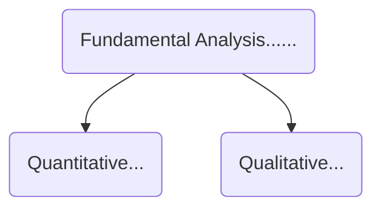

# Формирование портфеля

[1.2. Тактические идеи](#1.2.-Тактические-идеи)  
[2. Акции](#Акции)  
[3. Дивидинты](#Дивиденты)  
[4. Облигации](#Облигации)  
[5. Идеи для инвестирования](#Идеи-для-инвестирования)  
[6. Рынки](#Рынки)  
[7. Налоги](#Налоги)  
[8. Фундаментальный анализ](#8.-Фундаментальный-анализ)  
[8.1. Стратегии](#8.1.-Стратегии)  
[9. Технический анализ](#9.-Технический-анализ)
# Портфель
**Ядро портфеля:**
* акции
* облигации
* золото

**Структура портфеля:**
* консервативный
	* 70% облигации
	* 20% акции
	* 10% золото
* умеренный инвесто
	* 40-60% облигации
	* 30-40% акции
	* 10% золото
* агрессивный
	* 35% облигации
	* 50% акции
	* 15% золото

> * Определить риск профиль под каждую цель  
> * Хайповые акции - 5-7% от партфеля

## 1.2. Тактические идеи

10% от ядра акций на тактические идеи

# Акции

Прописявать причину покупки акции в портфеле

> Падение прибыли компании ниже падения стоимости акции, 
> то стоимость акции еще будет падать

- Календарь отчетности
    - сохрнать график отчечтности компаний
    - следить за отчетность своих компании из портфеля

**Правила формирования портфеля:**
* диверсификация
    * по секторам
    * отрицательная корреляция
* цикличные сектора

**Список акций Московской биржи:**
* первый уровень
* второй уровень
* третий уровень

## Чувствительность секторов к кризису и скорость востановления

> Первыми падают первыми подымаются  
Стимулирование экономики происходит через финансовый сектор  

1. Потреб сектора
2. Банки
3. Сырьевые компании
4. Телекомы
5. Электроэнергетика

## Ребалансировка портфеля по секторам
На время апреля 2020

- Лучше рынка: Телекомы, IT(РФ), электроэнергетика(Россети) - больше в портфеле
- Нейтрально: финансы, металлы, потреб сектор
- Хуже рынка: нефть - меньше в портфеле

![[первый эшелон Российского рынка]]
 [[Стратегии инвестирования]]

# Дивиденты
**Влияние на дивидендную политику компании:**
- чистая прибыль
- свободный денежный поток(FCF)
- EBITDA
- отношение чистого долга к EBITDA
- решения акционеров в пользу фиксированных выплат
- наличие правила увеличения дивидендов

**Дата дивидентной отсечки** - дата закрытия реестра  
**Дивидентный геп** - резкое падение стоимости акции после выплаты дивидентов  

# Облигации 

Доходность к погашению

# Рынки
- Китай 
- США
- Россия
- Европа

Май, июнь востановление рынка

- Макропоказатели рынка
- Микропоказатели рынка

# Идеи для инвестирования
- Акции Московской биржи. Брать. так как увеличила объем торгов февраль/март. соответсвенно покажет хорошую отчетность
- Магнит, Лента чуть чуть добавить в порфтель не должно быть сильных убытков по отчетности
- Юнипро квази - электроэнергетика защитный сектор застроховон от любых кризисов и скачков по нефти
- Сергутнефтигаз привилигированые. при сильной девольвации рубля хорошая выручка. на балансе активы привязаные к доллару
- Яндекс. растет всегда. поддержка правительства. нет драйверов для падения.
- Дивиденты по нефтеным компаниям будут зависить от их корпоротивной прибыли(снижается из-за снижения потребительской активности, укрепление рубля). 
- Транспортный компании(Аэрофлот) только убытки из-за снижения потребительской 
- Лукой и Сургутнефтегаз. Лукойл обвалиться в рублях если не будет договоренности с опек и Сургутнефтегаз вырасти если обвалиться рубль
- Газ считаеться лучше чем нефть 
- Сбер
- Роснефть
- Интеррао
- россвет

# Налоги

налого физ лиц 13%
	дивденды 

налого от облигаций 35%

Налоги отчисляет брокер
	приходят дивиденты отчищенные от налогов
	в момент вывода денег с продаж 
	по итогам года

оптимизация налогов  
закрыть убыточную позицию и снова купить до конца года. зафиксировать убыточность. таким образом общий доход уменьшелся  

налоговые льготы  
* владение цб 3 года более не платим налог с продажи, а с дивидендов платишь
* акции it рынка 1 год 
* доход в размере 3 миллионов за год не подлежат налогу, тоесть в течении 3 лет можно получить 9 мил
* 5 лет владения акциям лимит на налог получается 15 млн
* купоны по облигациями если ОФЗ и муницыпального займа

## 8. Фундаментальный-анализ

**сайты для быстрой оценки:**
* https://blackterminal.ru/
* https://simplywall.st/

**Мультипликаторы:**
- Капитализация
- Выручка
- Чистая прибыль
- P/S
- P/B
- EV/EBITDA
- Рентабельност EBITDA
- Долг/EBITDA

**Рост**  

>Отражает наши ожидания среднего темпа роста выручки компании в
ближайшие 4 года. 10 - самые быстрорастущие, 1 - медленнорастущие.  

 

**P/E**  
Price/Earnings
> Отношение рыночной цены акций компании к ожидаемой нами прибыли
в ближайшие 12 месяцев, очищенной от разовых и "бумажных" статей
отчёта о прибылях и убытков. Оценку 10 получают самые дешёвые по
показателю компании, 1- самые дорогие. 

 

**P/BV**  
Price/Book value of equity
> Отношение рыночной оценки капитала компании к балансовой
стоимости. За балансовую стоимость принимается прогноз показателя на
конец текущего года. Оценку 10 имеют самые дешёвые по показателю
компании, 1 - самые дорогие.

 

**ROE**  
Return on Equity  
Earnings/Book value of equity  
>Прибыль на акционерный капитал компании. Один из главных
показателей эффективности бизнеса для акционеров. За прибыль берется
прогноз её значения в ближайшие 12 месяцев. Оценку 10 получают
самые эффективные компании, 1 - неэффективные или убыточные.

 

**EV/EBIT**  
Enterprise Value/Earnings before interest and taxes  
>Показатель отражает то, как рынок оценивает прибыль компании от
основной деятельности. При этом Enterprise Value учитывает не только
рыночную оценку акционерного капитала, но и долг, что позволяет
сравнивать компании с разной структурой финансирования. Оценку 10
имеют самые дешевые компании по показателю, 1 - самые дорогие. 

 

**ROCE**  
Return on capital employed
EBIT/Capital Employed

> Показатель оценивает эффективность используемого капитала, поэтому по
сути он схож с Return on Equity. Однако в капитал включается также
долгосрочный долг, что позволяет сравнивать бизнес с разной структурой
капитала. В числителе показателя находится прогноз прибыли до уплаты
налогов и процентов в ближайшие 12 месяцев. Оценку 10 получают
компании с самым эффективным бизнесом, 1- наименее эффективным. 

 

**Yield**  
Dividend/Price
>Показатель отражает ожидаемую нами дивидендную доходность
компании в ближайшие 12 месяцев. Самые доходные с точки зрения
дивидендов акции получают оценку 10, компании, которые не платят
дивиденды -1 

 

**DSI**  
стабильность дивидендов
>В показателе DSI мы попытались отразить, насколько компания близка к
статусу "дивидендного аристократа", то есть способна стабильно
выплачивать дивиденды стремясь, к их повышению. Подробнее методика
описана здесь. Оценку 1 будут иметь компании, которые последние 7 лет
платили дивиденды, при этом регулярно их увеличивая. Значение 0
означает, что компания за последние 7 лет ни разу не платила дивиденды. 

> EPS - Earnings per share
> P/E - Price to earnings ration
> Share Price - Market value per share

рост кроткосрочных обязательст плохой звонок

## 8.1. Стратегии

![[Стратегии инвестирования]]

## 9. Технический анализ 
:frog:
**Фигуры тех анализа:**
* Тренды
    * канал
        * линия поддержки  
            * если пробил, то становиться линией сопротивления
        * линия сопротивления 
            * если пробил, то становиться линией поддержки
        * сужение канала изменение тренда
* Боковики
* Голова плечи
* Пятиволновка Эллиота+фибоначи

:panda_face: **Индекс momentum**
показывает перекупленость и недооцененость акции  
график momentum всегда стремиться к нулю
сильно вверху над нулем то сильно перекуплен

:camel: **Стохастический осциллятор**
график должен находиться от 20 до 80  
пересечение синего и красного намечается изменение тренда  

:whale2:**Индекс относительной силы**
может находиться в диапозоне 30-70
используется как проверка стохастического осциялтора, показывает есть ли еще диапозон для роста или нет

> чем сильнее рост или подение то создает импульс для изменения тренда  
> Gap рано или поздно закрываются. Gap цена сильно рвется от предыдущей цены  
> Боковик цена без тренда
  
![[IPO]]

![[список книг по финансам]]

