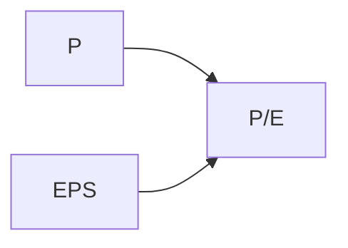
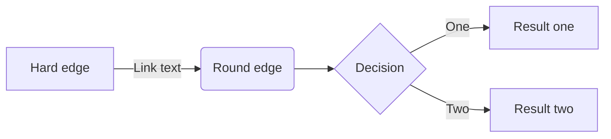

# Ratio

> EPS - Earnings per share
> P/E - Price to earnings ration
> Share Price - Market value per share

рост кроткосрочных обязательст плохой звонок

**сайты для быстрой оценки:**
* https://blackterminal.ru/
* https://simplywall.st/

